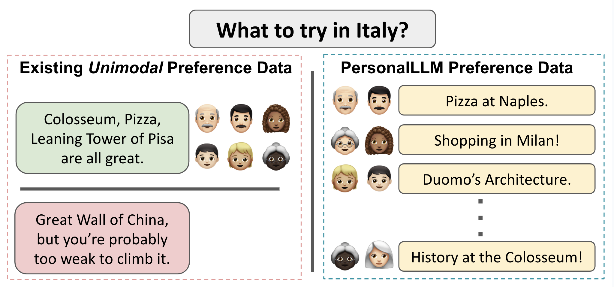
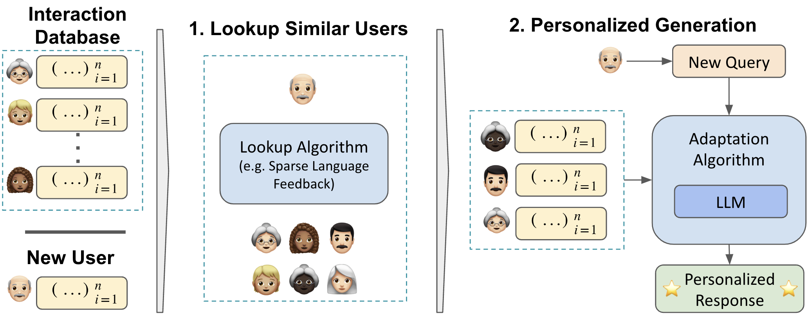

# PersonalLLM



**PersonalLLM** is designed to facilitate research in Large Language Model (LLM) personalization. Unlike traditional unimodal preference-style datasets, PersonalLLM offers a diverse set of prompts and responses that reflect a wide range of user preferences. Additionally, we provide an evaluation set for various personalization algorithms.



Attached is a recommendation systems inspired method for learning across users for personalization.

## Getting Started

### Environment Setup

To set up the environment, you can use either `poetry` (preferred) or `conda` with the provided `env.yml` file or `requirements.txt`:

For poetry, run:
```
poetry install
poetry shell
```

For conda, run:
```
conda create --name personalllm python=3.10
conda env update --file env.yml --prune
```

### Personalization Algorithm Evaluation

We'll love to see you contribute new personalization algorithms!
They are designed to be as easily contributable as possible, refer to 
- [Evaluation Guide](PersonalLLM/eval/README.md) 
- [Zero Shot Algorithm](PersonalLLM/eval/algorithms/ZeroShotAlgorithm.py)
- [K Shot ICL Algorithm](PersonalLLM/eval/algorithms/KShotICLAlgorithm.py)


### Dataset Generation

For detailed instructions on generating the dataset, please see the [Dataset Generation Guide](PersonalLLM/data/README.md).

### Dataset Samples

- [PersonalLLM](https://huggingface.co/datasets/namkoong-lab/PersonalLLM)
- [PersonalLLM-Eval](https://huggingface.co/datasets/namkoong-lab/PersonalLLM_Eval)

## Paper

All plots were generated using the code in [paper/visualize.ipynb](paper/visualize.ipynb) file.

## Contact:

Please email `andrew.siah@columbia.edu` for any help and open an issue for any bugs.
